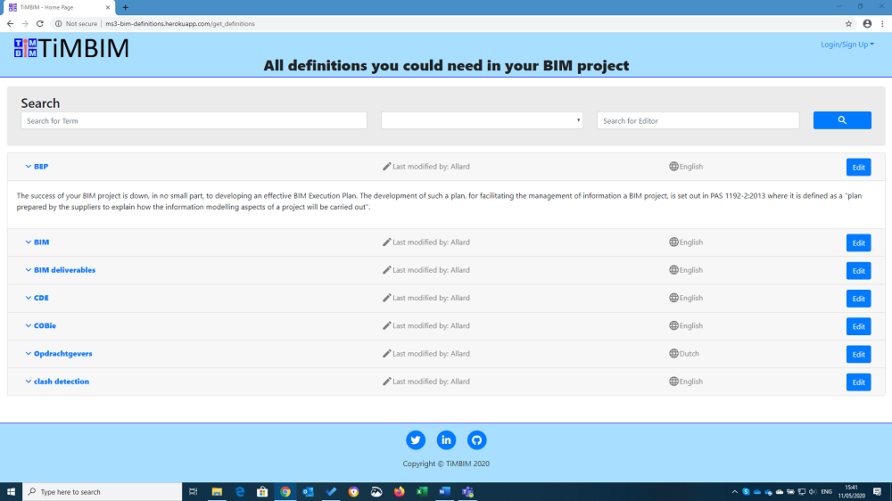

# TiMBIM Definitions

Code InstituteUser Data Centric Development Milestone Project

Given that there are a lot of BIM related terms that can give some confusion during projects I wanted to provide some help providing definitions for those terms.
The result is a website where you can search the definitions you need, add definitions you are missing and edit the ones you think need some extra clarification.
 
## UX
 
The website is meant for people that need some insight in terms that are mentioned during BIM projects. Wireframes were made in Adobe XD

### **Home Page**
List with all available terms and definitions sorted + search possibility. Search is not case sensitive + it is enough to just add a part of a term.

    

### **User SignUp**
User SignUp Page. Tests are added to verify.
* name is unique
* email is unique
* password and password confirmation are the same

    

### **User Login** 
Login Page. Test are added to verify Email and Password.

    

### **Edit User**
Possibility to edit Username or Password

    

### **Add Definition**
Possibility to add definitions. Only possible after login. Username will be added to edited/added definition

    

### **Edit Definition**
Possibility to edit existing definitions. Only possible after login. Username will be added to edited/added definition
    

## Features
 
### Existing Features
- Search engine - allows users to search for BIM definition based on there term, language and the editor
- Sign up - allows users to save there details for more functionality
- After login
    - Add definitions - allows users to add definitions that are still missing
    - Update definitions - allows users to edit definitions
    - Edit user information

For some/all of your features, you may choose to reference the specific project files that implement them, although this is entirely optional.

In addition, you may also use this section to discuss plans for additional features to be implemented in the future:

### Features Left to Implement
- Delete user account
- Recover password

## Technologies Used
1. HTML
2. CSS
3. Bootstrap (4.3.1)
4. Python
5. Flask
6. MongoDB - for storing all information in a database
7. Fontawesome - for brand icons
8. Material Design - for other icons

## Testing

The website is tested on different devices from smartphone to workstation with a 34" screen.
CSS was tested several times on "different devices" using developer tools in different webbrowsers. Using life editing in the webbrowser different settings were tested and improved.

### Testing of different forms:
1. Search form:
    1. Searching for Term=BI, Language="", Editor="": All results with "bi" (not casesensitive) are shown
    2. Searching for Term="", Language="Bulgarian", Editor="": Notification that there were no search results
    3. Searching for Term="", Language="", Editor="All": All results with "all" (not casesensitive) are shown
    4. after making all fields empty the complete list is shown again

2. Signup form:
    1. When adding a username that is already in use a warning is shown after trying to submit
    2. When adding a email address that is already or not valid in use a warning is shown after trying to submit
    3. When "password" does not match "repeat password" a warning is shown after trying to submit

3. Login form:
    1. When trying to log in with a not yet registered email a warning is shown after trying to submit
    2. When trying to log in with a password that does not match the user a warning is shown after trying to submit

4. Edit user form:
    1. When updating to a username that is already in use a warning is shown after trying to submit
    2. Email can not be updated
    3. When trying to update with a password that does not match the user a warning is shown after trying to submit
    4. When trying update the password with a password that does not match "repeat password" a warning is shown after trying to submit

5. Add defintion form:
    1. BIM term needs to be filled in to be able to add a definition
    2. Definition needs to be filled in to be able to add a definition

6. Edit defintion form:
    1. BIM term needs to be filled in to be able to update a definition
    2. Definition needs to be filled in to be able to update a definition

### Testing in on different screen sizes
- 34" screen

    
- 17" screen

    
- IPad

    
- Iphone

    
### Testing in in different browsers
- Edge

    
- Firefox

    
- Google Chrome

    

## Deployment

The website is hosted on [Heroku](https://ms3-bim-definitions.herokuapp.com/).

If you want to run the code locally, you can clone this repository into the editor of your choice by pasting: "git clone https://github.com/AllardL/MS3-BIM-definitions.git" into your terminal.
To cut ties with this GitHub repository, type git remote rm origin into the terminal.

This application makes use of MongoDB. If you want to use it you need to set up a database with the following collections: "definitions", "language" and "user" and provide the URI for the variable MONGO_URI,
also a key needs to be provided at the variable SECRET_KEY.

## Credits

### Content
- Some of the provided definitions are copied from the website of [NBS](https://www.designingbuildings.co.uk/wiki/BIM_glossary_of_terms)

### Media
- There was no media used from outside sources.

### Acknowledgements

- /